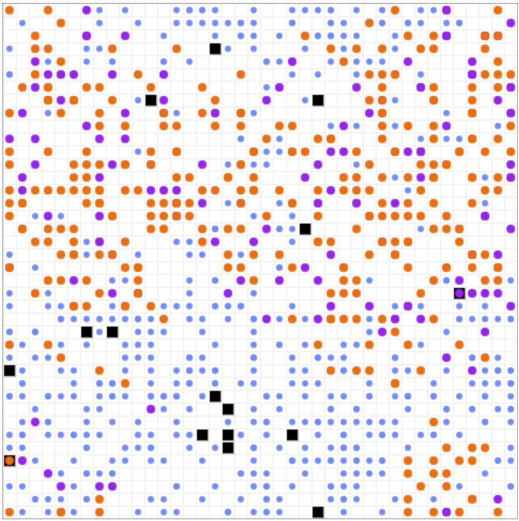

# Resistance Cascade Model

Paper can be found at:
[Mentos Regimes: How Individual Uncertainty Affects the Explosive Strength of Resistance Movements—People are the Real Freshmakers
](https://knowledge.uchicago.edu/record/6083?&ln=en)

## Summary
This article looks at the empirical data on protests in authoritarian countries as a function of regime type and information control, then constructs an agent based model to examine how the effect of uncertainty can help explain the differences in protest and resistance movements in these differing regime types. The agent based model instantiates two agent types, Citizen and Security, and shows how an inverse relationship between uncertainty with regards acceptable public opposition, the probability of suffering costs, and the ability to accurately perceive local regime support lead to differences in resistance movements. Analysis focuses on the speed of resistance spread between agents as a function of individual agent level uncertainty, and how this affects total resistance size, either full equilibrium flips, i.e. successful revolutions, or protracted unrest. Investigation of empirical data shows reduced frequency of protests in more authoritarian regimes and regimes with higher levels of information control. Modeling dynamics further confirms this behavior and shows a potential connection between lower information control and more frequent but slower spreading, smaller scale resistance events while higher information control is connected with faster inter-agent resistance spread, and larger resistance levels at a reduced frequency.

The data cleaning and analysis R scripts for the section Empirical Observations of Protest Events in Authoritarian Polities are in the 'R_regressions' folder.

The Python code for the agent based model is in the 'resistance_cascade' folder. The model is built using the Mesa framework for agent-based modeling in Python. 


## How to create a virtual environment using Ananconda and install dependencies
[Anaconda](https://www.anaconda.com/) is a free and open-source distribution of the Python and R programming languages for scientific computing, that aims to simplify package management and deployment. The following steps will create a virtual environment using Anaconda and install the dependencies.

replace `abm_resistance_cascade` with the name of your choice
```
    $ conda create -n abm_resistance_cascade --file requirements.txt
    $ conda activate abm_resistance_cascade
```

## How to Run

To use the model interactively, from the repository root directory run:

```
    $ python run.py
```

The console will print the URL, but you can also open your browser directly to [http://127.0.0.1:8521/](http://127.0.0.1:8521/), choose your parameters, press Reset, then Run.

## Files in resistance_cascade/

* ``model.py``: Core model.
* ``server.py``: Sets up the interactive visualization.
* ``agent.py``: Defines the base agent RandomWalker and the inheriting agents Citizen and Security.
* ``schedule.py``: Defines the base schedule SimultaneousActivationByType and the inheriting schedule with added functions.

## Model Visualization
<div style="text-align:center">
    
    <p>Figure: Resistance Cascade Agent Based Model Visualization with Advancing Cascade</p>
</div>

In the model visualization, circles represent Citizen agents in their three *public preference* states: blue being **Support**, purple being **Oppose**, and red being **Active**. Security are represented by the black squares. 

## Citizen Activation Function
The full breakdown of how Citizen activation works can be found in the paper, but a simplified explanation is as follows:

$$\sigma(-P_i - A_iJ_i + RL_i)$$

- $P_i$ - Private Preference
- $R$ - Ratio of **A**ctives and **O**pposed to **T**otal Citizen agents in vision.
- $L_i$ - Moderator of perception of spatially local regime support.
- $A_i$ - Calculated arrest probability.
- $J_i$ - Individual expected cost if arrested.

$P_i$ is multiplied by $-1$ so that a negative *private preference* corresponds to a positive move up the probability of activation in the sigmoid $\sigma$ function. In isolation of other factors, very few agents have a low enough *private preference* to exceed the model's global threshold constant for activation. For any cascade to start though, there must be at least one agent with a low enough *private preference* that that in combination with their epsilon $\epsilon_i$ parameter that they are willing to change to the **Oppose** or **Active** state when the probability of arrest and expected cost are 0. The analog of this would be that at least one agent must be dissatisfied enough with the regime, uncertain enough about where "the red line" is in terms of acceptable behavior, and believes they will get away with whatever action they decide to take that they would be willing to engage in some form of resistance to alleviate their *preference falsification*.

$$A_i = 1-e^{-2.3\frac{S}{A}2\sigma(\epsilon_i)}$$

$A_i$ is the individual perception of the probability of arrest if **Active**. This function adapted from [Epstein's (2002) "Modeling Civil Violence"](http://www.pnas.org/content/99/suppl.3/7243.short) is designed so that an agent always counts themselves as **A**ctive. In a scenario where a Citizen sees no other **A**ctive agents in their vision, and see one **S**ecurity agent, the ratio $\frac{S}{A} = \frac{1}{1}$ and the constant $k = -2.3$ then computes to $A=0.9$ absent the interaction with error term *epsilon* $\epsilon_i$. The function has a maximum value of 1 and a minimum value of 0. The example given by Epstein is that of a person with a Molotov cocktail looking at a storefront. If that person is standing alone on the street looking at 9 **S**ecurity officers arrayed around the storefront, the person would calculate that throwing that Molotov cocktail would produce an extremely high likelihood of being arrested. If on the other hand, that person was standing in a crowd of 200 other rioters facing the same 9 **S**ecurity officers, then that person would reasonably calculate that throwing that Molotov cocktail would produce a much lower chance of being arrested. $A_i$ is an approximation of the safety of crowds, the smaller the ratio of **S**ecurity officers to **A**ctive Citizens, the lower the value of the probability of being arrested. In the Resistance Cascade model, this function is altered to account for uncertainty. A Citizen with epsilon 

$$\epsilon_i = 0 \quad \quad \sigma(\epsilon_i) = 0.5 \quad \quad 2 * \sigma(\epsilon_i) = 1$$

has no error in calculating their probability of arrest, but those with more uncertainty over or underestimate their chances.

$$J_i = J * \sigma(\epsilon_i)$$

$J_i$ is the individual expected cost if arrested. In the model, jail terms $J$ are metered out by Security forces on **Active** and **Oppose** (where Opposed exceeds the global threshold constant) Citizens as a uniform distribution of 0 to the user defined maximum jail term where the default value in the model is 30 steps. In a uniform distribution, this means the average jail term is 15 steps. Those Citizens with a low error value *$\epsilon_i$* would correctly estimate that the cost of being arrested would be 15 steps or the sigmoid of zero epsilon *$\sigma(\epsilon = 0) = 0.5$*.

$$R = \frac{A+O}{T}$$

$R$ is the ratio of **Active** and **Opposed** Citizens to **Total** Citizens within a the Citizen agent's vision radius. The agent always counts themselves as **Active** and when interacted $L_i$, the Citizen's perception of that ratio, this produces the variable pair that can create resistance cascade events.

$$L_i = \frac{log(A+O)}{\epsilon_i^2 + 0.05}$$

$L_i$ is the encapsulation of a Citizen agent's uncertainty of the true *private preferences* of their neighbors. This interacts with their accurate view of the ratio of who in their vicinity is **Active** or **Opposed** to create their perception of regime support. The more information control in a society, the more accurately Citizens are able to understand where "the red line" falls, but the less able they are to understand the closely held true opinions of their neighbors. As epsilon $\epsilon_i$ in $L_i$ gets smaller, it exaggerates the effect of each **Active** Citizen in view. And while it may certainly feel this way sometimes, no person has infinite uncertainty, so a constant 0.05 is added in the denominator to tamper the effect of $\epsilon_i$ at extremely low values. This constant was an arbitrary value decided upon after multiple rounds of testing and comparing model outputs. **Active** and **Opposed** Citizens in view have a dampened effect via the log function. The first **Active** agent has a large effect on moving a Citizen's perception of local regime dissatisfaction but that effect decreases for each additional agent as each agent announcing a negative or anti-regime *public preference* has less informational effect.

## Further Reading

This model uses inspiration from:

[Kuran, Timur. "Now Out of Never: The Element of Surprise in the East European Revolutions of 1989." World Politics, Vol. 44 No. 1, Oct. 1991: 7-48.](https://pdodds.w3.uvm.edu/files/papers/others/1991/kuran1991.pdf)

[Epstein, J. “Modeling civil violence: An agent-based computational approach”, Proceedings of the National Academy of Sciences, Vol. 99, Suppl. 3, May 14, 2002](http://www.pnas.org/content/99/suppl.3/7243.short)

[Wolf Sheep Predation model](https://github.com/projectmesa/mesa-examples/tree/main/examples/wolf_sheep)
